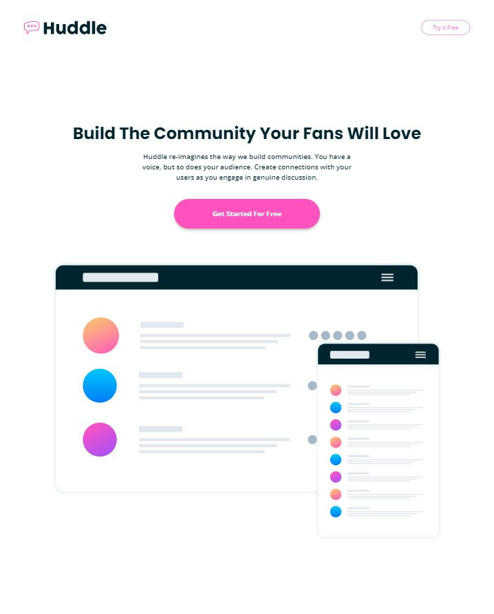
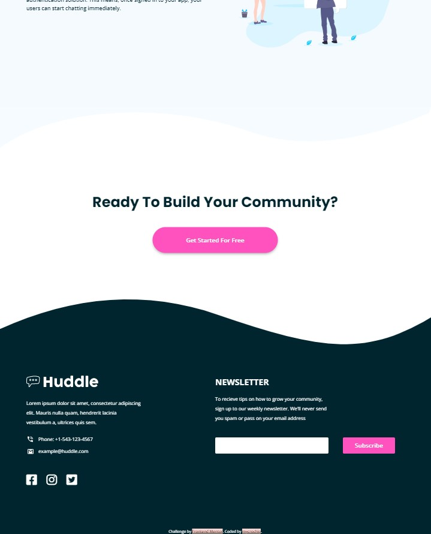

# Frontend Mentor - Huddle landing page with curved sections solution

This is a solution to the [Huddle landing page with curved sections challenge on Frontend Mentor](https://www.frontendmentor.io/challenges/huddle-landing-page-with-curved-sections-5ca5ecd01e82137ec91a50f2). Frontend Mentor challenges help you improve your coding skills by building realistic projects. 

## Table of contents

- [Overview](#overview)
  - [The challenge](#the-challenge)
  - [Screenshot](#screenshot)
  - [Links](#links)
- [My process](#my-process)
  - [Built with](#built-with)
  - [What I learned](#what-i-learned)
  - [Continued development](#continued-development)
- [Author](#author)


## Overview

### The challenge

Users should be able to:

- View the optimal layout for the site depending on their device's screen size
- See hover states for all interactive elements on the page

### Screenshot

#### Moble View - 375px
   

#### Desktop View - 1440px
   


### Links

- Solution URL: [GitHub](https://github.com/mycrochip/fylo-landing-page-with-curved-sections.git)

- Live Site URL: [GitHub Pages](https://mycrochip.github.io/fylo-landing-page-with-curved-sections/)


## My process

### Built with

- Semantic HTML5 markup
- CSS custom properties
- Flexbox
- CSS Grid
- Mobile-first workflow


### What I learned

A bit late for this but, I got to incorporate font awesome icons into my HTML code.

```html
<head>
  <script src="https://kit.fontawesome.com/df7b35a0c6.js" crossorigin="anonymous"></script>
</head>

<body>
  <div class="footer-socials">
    <a href="" class="icon">
      <i class="fa-brands fa-facebook-square"></i>
    </a>
    <a href="" class="icon">
      <i class="fa-brands fa-instagram"></i>
    </a>
    <a href="" class="icon">
      <i class="fa-brands fa-twitter-square"></i>
    </a>
  </div>
</body>
```

### Continued development

More projects to be completed on [FrotendEnd Mentor](https://www.frontendmentor.io/)!


## Author

- Frontend Mentor - [@mycrochip](https://www.frontendmentor.io/profile/mycrochip)
- Twitter - [@mycrochip_world](https://www.twitter.com/mycrochip_world)